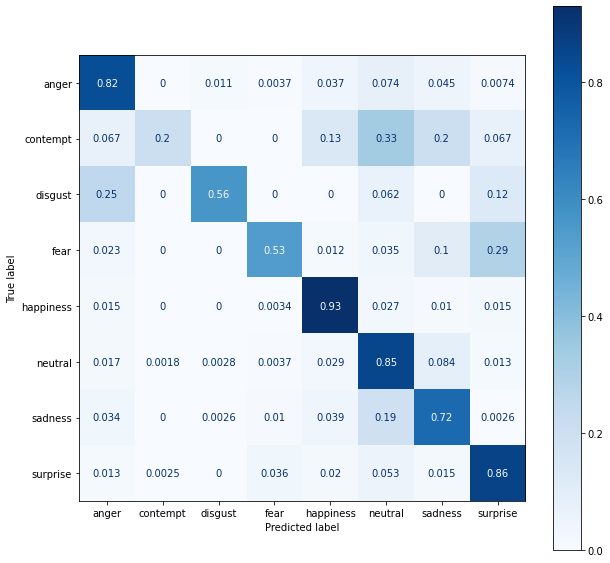

# facial_expression_recognition
As part of my bachelor's thesis on the classification of human emotions by facial image, I trained many models of the EfficientNetV2 family on FERPlus dataset.  

## Results
Go to Releases to get trained models in ONNX format.  

| Jupyter Notebook                                   | Accuracy | Precision | Recall | F1 Score |
| :------------------------------------------------- | :------- | :-------- | :----- | :------- |
| [5_classes_EfficientNetV2B1_96x96_bs_256_weighted] | 88.34%   | 86.29%    | 87.08% | 86.68%   |
| [8_classes_EfficientNetV2B0_96x96_bs_256_weighted] | 84.25%   | 72.75%    | 68.49% | 70.55%   |
| [8_classes_EfficientNetV2B1_96x96_bs_256_weighted] | 85.24%   | 73.97%    | 68.75% | 71.27%   |
| [8_classes_EfficientNetV2S_96x96_bs_32]            | 85.81%   | 75.12%    | 64.22% | 69.25%   |

<table>
    <tr>
        <td></td>
        <td></td>
    </tr>
    <tr>
        <td>5_classes_EfficientNetV2B1_96x96_bs_256_weighted]</td>
        <td>8_classes_EfficientNetV2B0_96x96_bs_256_weighted</td>
    </tr>
</table>

## Demo app
### How to run
1. Download [face-detection-retail-0044](https://github.com/openvinotoolkit/open_model_zoo/tree/master/models/public/face-detection-retail-0044) model from [Open Model Zoo](https://github.com/openvinotoolkit/open_model_zoo) repository and place it in the [app/models](/app/models/) folder.

2. Download a facial expression recognition model from Releases and place it in the [app/models](/app/models/) folder.

3. Run the program.
```
python app/app.py
```

### Screenshot


[5_classes_EfficientNetV2B1_96x96_bs_256_weighted]:/notebooks/5_classes_EfficientNetV2B1_96x96_bs_256_weighted.ipynb
[8_classes_EfficientNetV2B0_96x96_bs_256_weighted]:/notebooks/8_classes_EfficientNetV2B0_96x96_bs_256_weighted.ipynb
[8_classes_EfficientNetV2B1_96x96_bs_256_weighted]:/notebooks/8_classes_EfficientNetV2B1_96x96_bs_256_weighted.ipynb
[8_classes_EfficientNetV2S_96x96_bs_32]:/notebooks/8_classes_EfficientNetV2S_96x96_bs_32.ipynb
